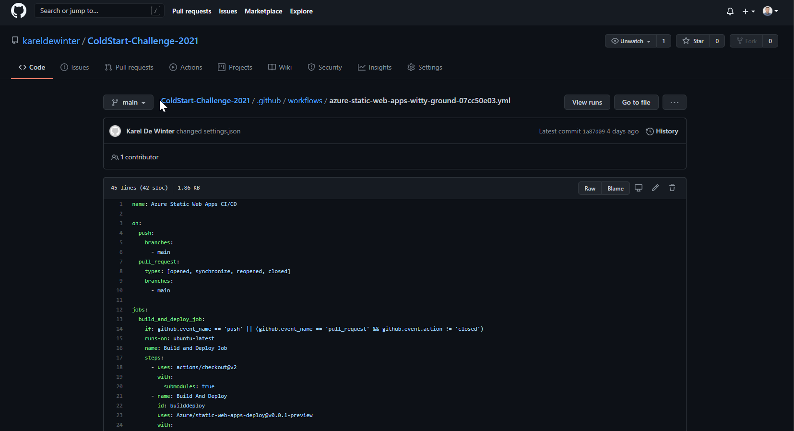

# ColdStart-Challenge-2021 -> First Challenge!
This will be the **first** challenge of the [**ColdStart coding challenge 2021**](https://github.com/ColdStart-Challenge)

## Challenge Objectives 🥇

To successfully complete this first challenge, I will need to:

1. Build and host a website on Azure Static Websites. 
2. Only authenticated users can pre-order items.
3. The customer pre-order JSON document needs to be stored in Azure Queue Storage.

## The application

The app is a web application that will be hosted in Azure Static Web Apps. It consists of two components:

- Vue.js frontend
- Node.js backend apis, running on Azure Functions

## How to test this application 🐧

Azure Static Web Apps publishes a website to a production environment by building apps from a GitHub repository. In this quickstart, you deploy a web application to Azure Static Web apps using the Visual Studio Code extension.

If you don't have an Azure subscription, [create a free trial account](https://azure.microsoft.com/free).

## Prerequisites

- [GitHub](https://github.com) account
- [Azure](https://portal.azure.com) account
- [Visual Studio Code](https://code.visualstudio.com)
- [Azure Static Web Apps extension for Visual Studio Code](https://marketplace.visualstudio.com/items?itemName=ms-azuretools.vscode-azurestaticwebapps)

First you clone or fork this repo.
Next, open Visual Studio Code and go to **File > Open Folder** to open the repository you just cloned to your machine in the editor.

Once you are ready, let's create a static web app!

## Create a static web app

1. Inside Visual Studio Code, select the Azure logo in the Activity Bar to open the Azure extensions window.

    > [!NOTE]
    > Azure and GitHub sign in are required. If you are not already signed in to Azure and GitHub from Visual Studio Code, the extension will prompt you to sign in to both during the creation process.

1. Place your mouse over the _Static Web Apps_ label and select the **plus sign**.

1. The command palate opens at the top of the editor and prompts you to choose a subscription.

    Choose a subscription and press **Enter**.

1. The editor prompts you to name your application.

    Choose a name and press **Enter**.

1. Select the built preset to configure default project structure.

    Choose built and press **Enter**.

1. Select a location nearest you and press **Enter**.

1. Once the app is created, a confirmation notification is shown in Visual Studio Code.

Now let the magic happen and have a look at your Azure environment and GitHub environment. There will be a resource group created with the same name and a Static Web App will be available!

Click on the static web app to find the details and the public link to your App.

Go to your GitHub repository and find the details of the WorkFlows.

## Create a storage account

To store the ice-cream orders, we need a storage account.
Azure Queue Storage will be used to put the orders in a queue.

Search the Access Key for your storage account and note it down for now, we need it in the next step.

Now go back to your Static Web App and change the configuration.
Add a variable named: __AZURE_STORAGE_CONNECTIONSTRING__ and paste in you storage account key.

That should be it, now you can test out the application and see the Queue filling up with ice-cream orders!

Enjoy! 🐧